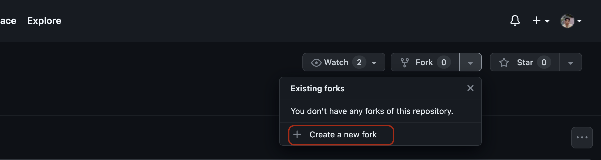
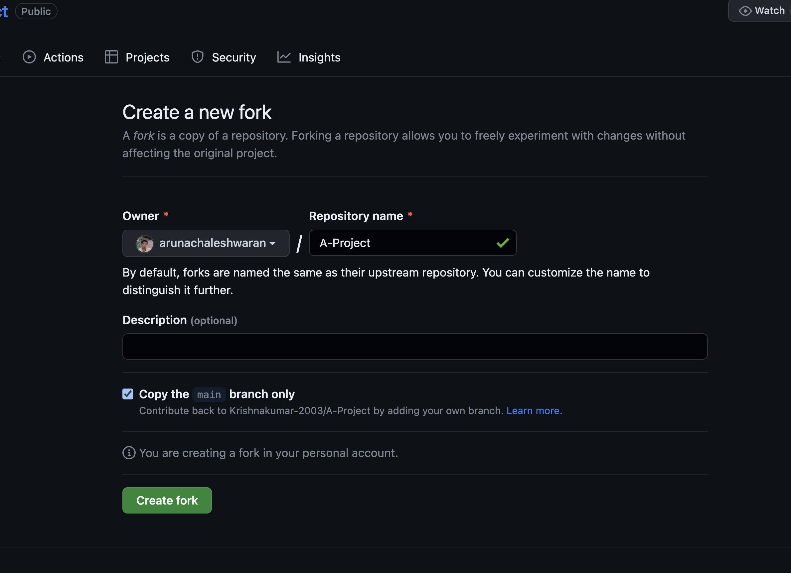
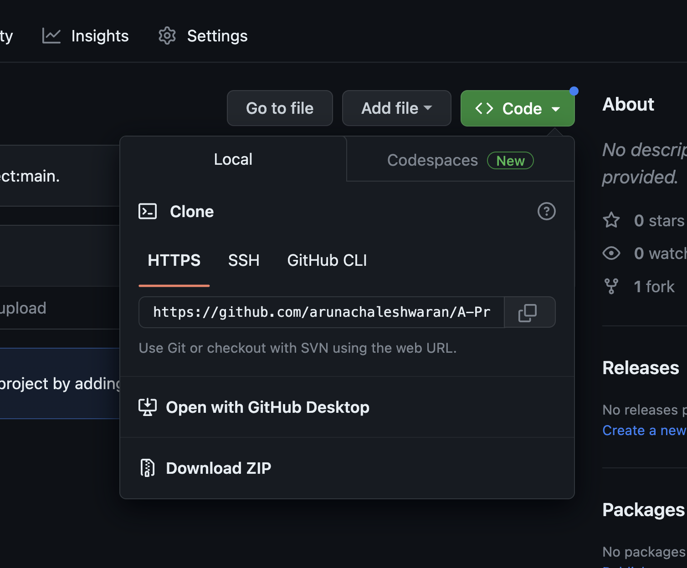
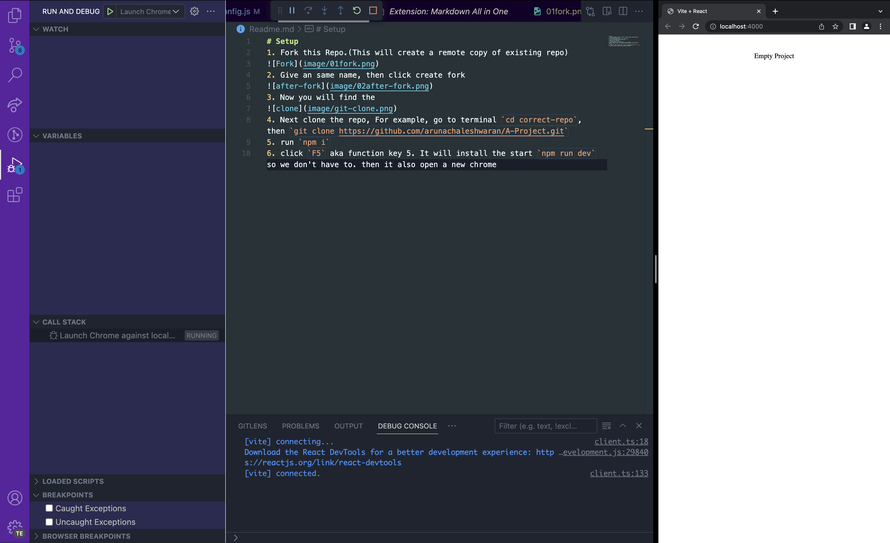

# Setup
1. Fork this Repo.(This will create a remote copy of existing repo)

2. Give an same name, then click create fork

3. Now you will find the 

4. Next clone the repo, For example, go to terminal `cd correct-repo`, then `git clone https://github.com/arunachaleshwaran/A-Project.git`
5. run `npm i`
6. click `F5` aka function key 5. It will install the start `npm run dev` so we don't have to. then it also open a new chrome.
